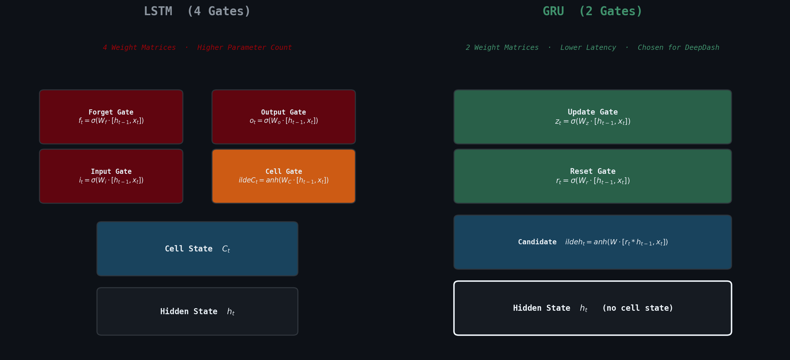

# DeepDash
**Latent Dynamics & Temporal Sequence Control for Geometry Dash**

**Course:** Representation Learning

**Architecture:** World Models (VAE + GRU + Controller)

## 1. Project Overview

DeepDash is a Deep Reinforcement Learning agent designed to master procedural *Geometry Dash* levels within a custom-built game engine. Unlike standard RL approaches that map pixels directly to actions, DeepDash explicitly separates **visual perception** from **control policy**.

This project implements a modified "World Models" architecture, demonstrating how an agent can learn a compressed **latent representation** of the game world and "dream" deterministic future states to optimize its trajectory.

## 2. Technical Architecture
The system is composed of three distinct neural networks trained sequentially:

### A. Vision Model (V) - *The Representation Learner*
* **Type:** Variational Autoencoder (VAE).
* **Input:** Raw RGB frames ($64 \times 64 \times 3$).
* **Function:** Compresses visual data into a low-dimensional latent vector ($z \in \mathbb{R}^{32}$).
* **Optimization:** Utilizes $L_2$ loss for the Phase 1 semantic engine, and $L_1$ loss for Phase 3 real-game footage to enforce high-frequency noise rejection.
* **Relevance:** Demonstrates unsupervised feature extraction of macroscopic game entities (spikes, blocks, player).

### B. Memory Model (M) - *The Dynamics Learner*

* **Type:** Gated Recurrent Unit (GRU).
* **Function:** Predicts the exact next latent state ($z_{t+1}$) given the current state ($z_t$) and action ($a_t$).
* **Relevance:** Learns the rigid physics engine and temporal dynamics using a computationally efficient RNN, allowing the agent to "hallucinate" precise trajectories without the complexity of LSTM gates.

### C. Controller (C) - *The Agent*
* **Type:** Linear Single-Layer Perceptron.
* **Function:** Maps the concatenated state vector ($z_t, h_t$) to an optimal action (Jump / No Jump).
* **Environment:** **Latent Dream.** The agent is trained entirely inside the hallucinated environment generated by the Memory Model, allowing for massive parallelization (thousands of episodes per second) before being deployed zero-shot into the real engine.
* **Optimization:** Covariance Matrix Adaptation Evolution Strategy (CMA-ES).

## 3. The Custom Engine
The environment is a custom-written *Geometry Dash* clone designed for accelerated training.
* **Headless Mode:** Decoupled rendering for high-speed simulation.
* **Semantic Color Palette:** Engine renders entities with distinct, meaningful colors (Player=Green, Danger=Red, Environment=Blue/Black), simplifying the visual input for the VAE.
* **Deterministic Physics:** Fixed framerate and gravity ensure reproducibility, eliminating the need for stochastic modeling.

## 4. Design Rationale & Engineering Decisions
This implementation optimizes the original World Models architecture (Ha & Schmidhuber, 2018) to align with the specific constraints of the *Geometry Dash* environment.

### 4.1 Deterministic Dynamics (Removal of MDN)
The original architecture utilized a **Mixture Density Network (MDN)** to model environmental uncertainty (e.g., enemy movement in *Doom*).
* **Observation:** The custom *Geometry Dash* engine is strictly deterministic; a specific input at a specific state always yields the same outcome.
* **Decision:** Replaced the probabilistic MDN-RNN with a deterministic regression RNN.
* **Benefit:** Eliminates sampling noise and "representation blurring," allowing for high-fidelity latent rollouts with significantly lower computational overhead.

### 4.2 Recurrent Efficiency (GRU vs. LSTM)
The selection of the GRU over the standard LSTM is grounded in the architectural efficiency demonstrated by Cho et al. (2014).
* **Observation:** The LSTM architecture requires four gating mechanisms, introducing redundant parameters for this specific task.
* **Decision:** Implemented a Gated Recurrent Unit (GRU).
* **Benefit:** The GRU's two-gate structure (Reset and Update) efficiently captures the necessary temporal dependencies (jump timing) while reducing training time and parameter count compared to an LSTM.

### 4.3 Inference Latency (Rejection of MPC)
**Model Predictive Control (MPC)** was evaluated as a replacement for the Linear Controller.
* **Observation:** *Geometry Dash* requires high-frequency decisions (60 FPS / ~16ms window). MPC requires iterative rollout simulations during inference time.
* **Decision:** Retained the reactive Linear Controller ($Action = W \cdot [z, h]$).
* **Benefit:** Ensures $O(1)$ inference time, preventing input lag that would otherwise cause agent failure in a high-speed reaction environment.

### 4.4 Training Protocol: The "Dreaming" Loop
To overcome the limitations of deterministic generation (Mode Collapse), the agent is trained using an **Iterative Burn-In Strategy**:
1.  **Context Injection (Burn-In):** The Memory Model (M) is primed with a sequence of $T=64$ real frames from the game engine. This "seeds" the RNN hidden state ($h_t$) with the position and velocity of incoming obstacles.
2.  **Latent Extrapolation (Dreaming):** The real engine is disconnected. The Memory Model takes over, extrapolating the physics of the seeded obstacles for $T=100+$ steps.
3.  **Policy Optimization:** The Controller (C) interacts solely with this hallucinated environment.
4.  **Reset & Diversify:** Upon death or timeout, a new random 64-frame "seed" from a different level segment is loaded.

## 5. Project Roadmap: Execution Strategy
The training pipeline is structured to validate components individually before full integration.

### Phase 1: The "Sanity Check" (Real Custom Engine)
* **Goal:** Validate the Vision Model (V) compression quality.
* **Method:** Train the Controller (C) directly in the **Real Custom Engine**.
* **Success Metric:** If the agent cannot learn to jump over a single spike in the real engine, the VAE is flawed.
* **Status:** *Pre-requisite for Dream Training.*

### Phase 2: The "World Model" (Latent Custom Engine)
* **Goal:** Validate the Memory Model (M) dynamics and optimize training speed.
* **Method:** Train the Controller (C) inside the **Dream** (Latent Space) using the Burn-In strategy.
* **Advantage:** Massive parallelization ($10{,}000+$ FPS).
* **Success Metric:** Agent masters procedural levels using only hallucinated physics.

### Phase 3: The "Transfer" (Real Game Video Dreams)
* **Goal:** Master the real *Geometry Dash* application.
* **Method:** Train a new V and M on **video recordings** of the real game. To filter high-frequency stochastic noise (particles, weather effects) without contrastive learning bloat, the Vision Model (V) is structurally modified:
    * **Aggressive Spatial Downsampling:** Deep convolutional layers with Max Pooling to physically eradicate sub-pixel noise prior to the latent bottleneck.
    * **Objective Function Shift:** Reconstruction loss is switched from $L_2$ (MSE) to $L_1$ (Mean Absolute Error) to prevent the decoder from penalizing localized, transient pixel anomalies.
* **Deployment:** Run the trained Controller on the real game (Zero-Shot Transfer).

## 6. Benchmark Metrics
The Phase 1 (Real Engine) and Phase 2 (Dream) training pipelines are evaluated on two complementary efficiency axes:

* **Sample Efficiency (Quality):** Agent score after a fixed number of environment frames $N$. The Real Engine agent is expected to dominate this metric, as it trains on ground-truth physics free of compounding approximation error from the learned dynamics model.
* **Wall-Clock Efficiency (Speed):** Agent score after a fixed training duration $T$. The Dream agent is expected to dominate this metric, as latent-space rollouts bypass the rendering pipeline entirely, enabling orders-of-magnitude higher throughput ($10{,}000+$ FPS vs. real-time).

## 7. References
* **Primary Architecture:** Ha, D., & Schmidhuber, J. (2018). *World Models*. [arXiv:1803.10122](https://arxiv.org/abs/1803.10122)
* **Recurrent Dynamics (GRU):** Cho, K., et al. (2014). *Learning Phrase Representations using RNN Encoder-Decoder for Statistical Machine Translation*. [arXiv:1406.1078](https://arxiv.org/abs/1406.1078)
* **Foundational RL:** Mnih, V., et al. (2013). *Playing Atari with Deep Reinforcement Learning*. [arXiv:1312.5602](https://arxiv.org/abs/1312.5602)