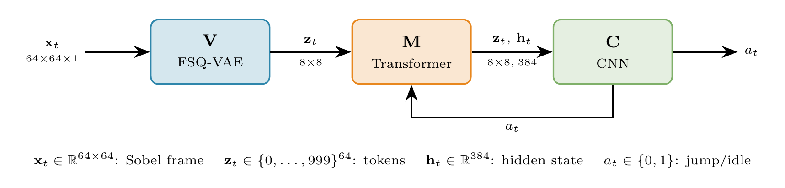

# SLS-WM
### Structured Label Smoothing for Joint-Embedding Discrete World Models

[Florent Tariolle](mailto:florent.tariolle@insa-rouen.fr), INSA Rouen Normandy

**Abstract:** Discrete world models tokenize observations with a learned quantizer and predict next-frame tokens with a transformer. Standard cross-entropy treats every incorrect prediction as equally wrong, discarding a signal that Finite Scalar Quantization (FSQ) makes available by construction: each code sits on an integer coordinate lattice, so some wrong predictions are near-misses while others are gross errors. We introduce *FSQ-Structured Label Smoothing* (SLS), a training objective that replaces uniform label smoothing with a kernel over FSQ lattice coordinates, and train the encoder jointly with the dynamics transformer entirely in the discrete latent space. We evaluate on Geometry Dash, a deterministic platformer with binary actions, where the controller is trained in imagination and deployed at 30 FPS on the real game via screen capture.

<p align="center">
   <b>[ <a href="https://tariolle.github.io/sls-wm/">Website</a> | <a href="https://github.com/Tariolle/sls-wm">Code</a> ]</b>
</p>

<p align="center">
  
</p>

> **Status:** Pre-freeze research code. Model freeze target **2026-05-31**, NeurIPS 2026 workshop submission. Numerical results and ablation tables will land with the final model; this repository currently describes the method and architecture, not outcomes.

## Using the code

**Environment.** Conda, PyTorch 2.10, CUDA 12.6.
```bash
conda run -n <env> python -m pip install -r requirements.txt
```

**Train the world model (V + M jointly):**
```bash
python scripts/train_world_model.py --config configs/e6.10-gaussian-single-group.yaml
```

**Train the controller (BC warm-start, then PPO in imagination):**
```bash
python scripts/train_controller_bc.py  --config configs/e6.10-gaussian-single-group.yaml
python scripts/train_controller_ppo.py --config configs/e6.10-gaussian-single-group.yaml
```

**Deploy to the live game (screen capture, 30 FPS):**
```bash
python scripts/deploy.py --config configs/e6.10-gaussian-single-group.yaml
```

Cluster launches (SLURM, A100): `sbatch slurm/train_world_model.sl`, `sbatch slurm/train_controller.sl`.

## Contact

Feel free to open [issues](https://github.com/Tariolle/sls-wm/issues). For questions or collaborations, contact `florent.tariolle@insa-rouen.fr`.
