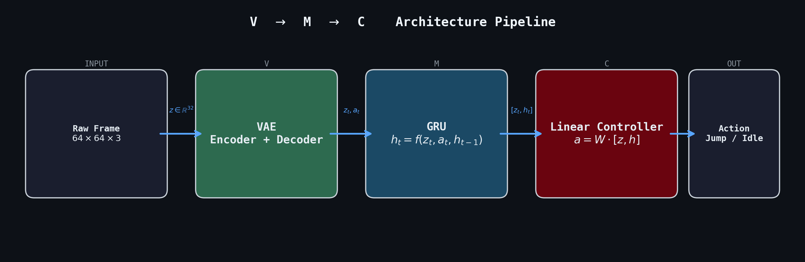
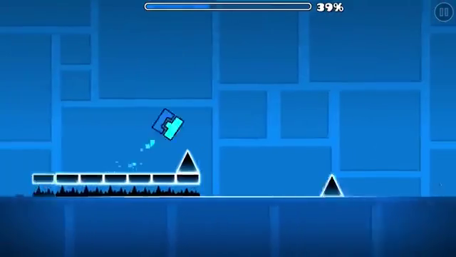
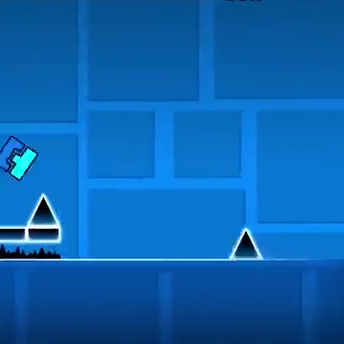
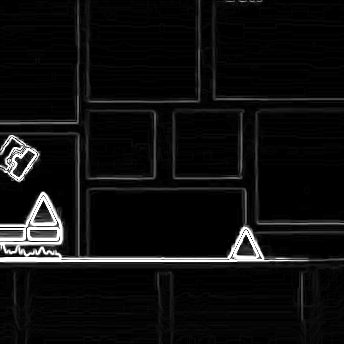

# DeepDash

**Latent Dynamics & Temporal Sequence Control for Geometry Dash**

**Course:** Representation Learning

**Architecture:** World Models (VQ-VAE + Transformer + Controller)

## 1. Project Overview

DeepDash is a Deep Reinforcement Learning agent designed to master *Geometry Dash* levels directly from raw gameplay footage. Unlike standard RL approaches that map pixels directly to actions, DeepDash explicitly separates **visual perception** from **control policy**.

This project implements a modified "World Models" architecture, demonstrating how an agent can learn a compressed **latent representation** of the real game world and "dream" deterministic future states to optimize its trajectory.

## 2. Technical Architecture

The system is composed of three distinct neural networks trained sequentially:

### A. Vision Model (V) - *The Tokenizer*

* **Type:** Vector Quantized Variational Autoencoder (VQ-VAE).
* **Input:** Preprocessed grayscale Sobel edge maps ($64 \times 64 \times 1$) captured from real *Geometry Dash* gameplay.
* **Preprocessing Pipeline:**

| Raw frame (640x360) | Square crop (344x344) | Sobel edges (344x344) | Final input (64x64) |
|:---:|:---:|:---:|:---:|
|  |  |  |  |

  Raw 360p footage is cropped to a 344x344 square at (220, 16) — bottom-aligned to discard the UI progress bar, player flush to the left edge, maximizing forward obstacle visibility. Sobel edge detection is applied at full resolution before downscaling to $64 \times 64$ with `cv2.INTER_AREA`. The UI is deliberately excluded to prevent the model from memorizing level layouts via the progress indicator, forcing it to learn **reactive dynamics** rather than positional lookup.

* **Function:** Tokenizes visual data into a $6 \times 6$ grid of discrete codebook indices (36 tokens per frame, vocabulary of 1024). Each token is a discrete symbol, not a continuous vector — enabling **91x compression** (360 bits vs 32,768 bits per frame).
* **Noise Filtering:** Real game footage contains high-frequency stochastic noise (particles, weather effects, visual polish). Sobel edge detection extracts only structural boundaries (platforms, spikes, player outline), and the discrete codebook further discards sub-token noise by snapping encoder outputs to the nearest learned prototype.
* **Why VQ-VAE over beta-VAE:** A standard beta-VAE was extensively evaluated first (beta=0/0.1/1.0, cyclical annealing, MSE/L1/BCE, latent dims 32-64). All configurations produced fundamentally blurry reconstructions due to Gaussian posterior averaging — spikes were indistinguishable from blocks. For a precision rhythm game requiring pixel-accurate obstacle recognition, this is a dealbreaker. VQ-VAE's discrete codebook eliminates this blurriness entirely.

### B. Memory Model (M) - *The Dynamics Learner*

* **Type:** Transformer (autoregressive, on discrete tokens).
* **Input:** Sequence of 36 codebook indices per frame + action token.
* **Function:** Predicts the next frame's 36 tokens given the current tokenized state and action — a classification task over vocabulary 1024, not continuous regression.
* **Why Transformer over GRU:** With a GRU, the VQ-VAE's quantized vectors must be flattened into a continuous input (36 x 32d = 1,152 floats), yielding only 3.6x compression over the raw frame — making the vision model a near pass-through. A Transformer operates directly on discrete token indices, preserving the full 91x compression. The Transformer also naturally handles action conditioning via attention and captures long-range spatial dependencies across the token grid. This aligns with modern world model architectures (IRIS, GENIE) that use Transformers on VQ-VAE tokens.
* **Relevance:** Learns the game's physics and temporal dynamics entirely in discrete latent space, allowing the agent to "hallucinate" precise trajectories as token sequences.

### C. Controller (C) - *The Agent*

* **Type:** Linear Single-Layer Perceptron.
* **Function:** Maps the Transformer's hidden state to an optimal action (Jump / No Jump).
* **Environment:** **Latent Dream.** The agent is trained entirely inside the hallucinated environment generated by the Memory Model, allowing for massive parallelization (thousands of episodes per second) before being deployed zero-shot into the real game.
* **Optimization:** Covariance Matrix Adaptation Evolution Strategy (CMA-ES).

## 3. Design Rationale & Engineering Decisions

This implementation optimizes the original World Models architecture (Ha & Schmidhuber, 2018) to align with the specific constraints of the *Geometry Dash* environment.

### 3.1 Deterministic Dynamics (Removal of MDN)

The original architecture utilized a **Mixture Density Network (MDN)** to model environmental uncertainty (e.g., enemy movement in *Doom*).

* **Observation:** *Geometry Dash* physics are strictly deterministic; a specific input at a specific state always yields the same outcome. Visual stochasticity (particles, effects) is noise, not meaningful state.
* **Decision:** Replaced the probabilistic MDN-RNN with a deterministic sequence model.
* **Benefit:** Eliminates sampling noise and "representation blurring," allowing for high-fidelity latent rollouts with significantly lower computational overhead.

### 3.2 Discrete Tokenization (VQ-VAE over beta-VAE)

The original World Models paper uses a beta-VAE with continuous Gaussian latents.

* **Observation:** Beta-VAE reconstructions are fundamentally blurred by posterior averaging. After exhaustive hyperparameter search (beta values, annealing schedules, loss functions, latent dimensions), reconstructions could not distinguish spikes from blocks — a fatal limitation for a precision game.
* **Decision:** Replaced the beta-VAE with a VQ-VAE producing 36 discrete tokens per frame.
* **Benefit:** Sharp reconstructions that preserve gameplay-critical structure. The discrete codebook acts as a learned visual vocabulary — each token represents a meaningful spatial pattern (block, spike, floor, empty space) rather than a blurry average.

### 3.3 Transformer World Model (over GRU)

The original architecture uses a GRU operating on flattened continuous latent vectors.

* **Observation:** Feeding the GRU flattened VQ-VAE vectors (36 x 32d = 1,152 floats) yields only 3.6x compression over the raw 4,096-pixel input. The vision model becomes a near pass-through rather than a meaningful compression stage. At higher spatial resolutions (14x14), the flattened representation actually *expands* beyond the input size.
* **Decision:** Replaced the GRU with a Transformer operating on discrete codebook indices.
* **Benefit:** Preserves the full 91x compression ratio (36 tokens x 10 bits = 360 bits vs 32,768 bits). The Transformer classifies over a 1024-entry vocabulary rather than regressing continuous vectors, and its own embedding layer decouples working dimensionality from the VQ-VAE codebook.

### 3.4 Inference Latency (Rejection of MPC)

**Model Predictive Control (MPC)** was evaluated as a replacement for the Linear Controller.

* **Observation:** *Geometry Dash* requires high-frequency decisions (60 FPS / ~16ms window). MPC requires iterative rollout simulations during inference time.
* **Decision:** Retained the reactive Linear Controller ($Action = W \cdot h_t$).
* **Benefit:** Ensures $O(1)$ inference time, preventing input lag that would otherwise cause agent failure in a high-speed reaction environment.

### 3.5 Input Preprocessing (64x64 Square Crop, Sobel Edges)

The original World Models paper uses $64 \times 64$ RGB inputs.

* **Observation:** *Geometry Dash* renders in 16:9 widescreen with visually noisy backgrounds. Raw RGB wastes encoder capacity on particles, color gradients, and decorations that carry zero gameplay information.
* **Decision:** Crop to a 344x344 gameplay square (player left-aligned, forward obstacles visible), apply Sobel edge detection at full resolution, then downscale to $64 \times 64$ grayscale. The encoder uses 3 no-padding stride-2 convolutions (64 → 31 → 14 → 6), producing the $6 \times 6$ spatial grid for tokenization.
* **Benefit (Sobel):** Extracts structural boundaries — platforms, spikes, player outline — while discarding most of the visual noise. Binary-like edges are far easier for the VQ-VAE to reconstruct sharply.
* **Benefit (UI Removal):** The progress bar encodes the player's absolute position within a specific level. Retaining it would allow the model to memorize level layouts ("at 47%, a triple spike appears") rather than learning **reactive obstacle dynamics**. Removing it forces the agent to rely solely on visual obstacle perception, producing a more generalizable policy.

### 3.6 Training Protocol: The "Dreaming" Loop

To overcome the limitations of deterministic generation (Mode Collapse), the agent is trained using an **Iterative Burn-In Strategy**:

1. **Context Injection (Burn-In):** The Memory Model (M) is primed with a sequence of $T=64$ real frames (as token sequences) from recorded gameplay. This "seeds" the Transformer's context with the position and velocity of incoming obstacles.
2. **Latent Extrapolation (Dreaming):** The real footage is disconnected. The Memory Model takes over, autoregressively predicting token sequences for $T=100+$ steps.
3. **Policy Optimization:** The Controller (C) interacts solely with this hallucinated environment.
4. **Reset & Diversify:** Upon death or timeout, a new random 64-frame "seed" from a different gameplay segment is loaded.

## 4. Project Roadmap

### Phase 1: Vision — VQ-VAE Tokenizer on Real Game Footage

* **Goal:** Train the Vision Model (V) to tokenize gameplay frames into a compact discrete representation.
* **Method:** Capture gameplay footage, extract Sobel edge frames, and train the VQ-VAE with MSE loss and a 1024-entry codebook.
* **Success Metric:** The VQ-VAE reconstructs gameplay frames preserving macroscopic structure (platforms, spikes, player position) while discarding visual noise. Codebook entries correspond to distinct gameplay elements.
* **Milestone:** This phase alone validates the core contribution of the project.

### Phase 2: Dynamics — Transformer World Model

* **Goal:** Learn the game's temporal dynamics entirely in discrete latent space.
* **Method:** Train the Transformer on sequences of $(tokens_t, a_t) \rightarrow tokens_{t+1}$ from recorded gameplay.
* **Success Metric:** The Memory Model accurately predicts future token sequences over extended rollouts.

### Phase 3: Control — Dream-Trained Agent

* **Goal:** Train an agent that masters *Geometry Dash* levels without ever touching the real game.
* **Method:** Train the Linear Controller with CMA-ES inside the "Dream" using the Burn-In strategy.
* **Success Metric:** Zero-shot deployment — the agent plays the real game using only the learned latent dynamics.

## 5. References

* **Primary Architecture:** Ha, D., & Schmidhuber, J. (2018). *World Models*. [arXiv:1803.10122](https://arxiv.org/abs/1803.10122)
* **VQ-VAE:** van den Oord, A., Vinyals, O., & Kavukcuoglu, K. (2017). *Neural Discrete Representation Learning*. [arXiv:1711.00937](https://arxiv.org/abs/1711.00937)
* **Transformer World Model (IRIS):** Micheli, V., Alonso, E., & Fleuret, F. (2023). *Transformers are Sample-Efficient World Models*. [arXiv:2209.00588](https://arxiv.org/abs/2209.00588)[arXiv:1406.1078](https://arxiv.org/abs/1406.1078)
* **Foundational RL:** Mnih, V., et al. (2013). *Playing Atari with Deep Reinforcement Learning*. [arXiv:1312.5602](https://arxiv.org/abs/1312.5602)
